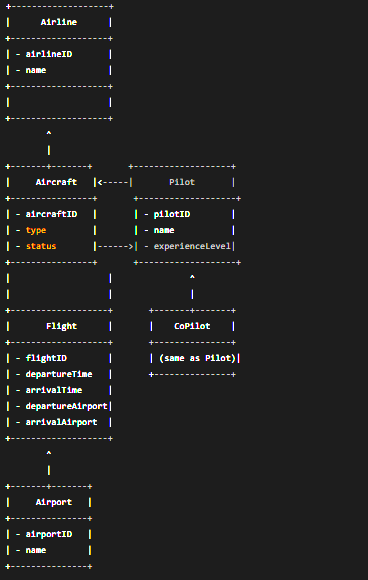

# ucus-yonetim-sistemi

Uçuşlar ve pilotların yönetimi için tasarlanacak bir sistem, birkaç temel sınıf ve bu sınıflar arasındaki ilişkileri içermelidir. Bu sınıflar, uçuşları, uçakları, pilotları, hava yolları şirketlerini ve havaalanlarını modelleyecektir. Aşağıda, sistemin nasıl tasarlanabileceğiyle ilgili bir açıklama ve temel bir sınıf diyagramı önerisi yer almaktadır.

Sınıflar ve İlişkiler:
Airline (Hava Yolu Şirketi) Sınıfı:

Özellikler: airlineID, name
İlişkiler: Birden fazla Aircraft ve Pilota sahiptir.
Aircraft (Uçak) Sınıfı:

Özellikler: aircraftID, type, status (Çalışır/Onarım durumunda)
İlişkiler: Bir Airlinea aittir ve birden fazla Flight gerçekleştirebilir.
Pilot Sınıfı:

Özellikler: pilotID, name, experienceLevel
İlişkiler: Bir Airline ile ilişkilendirilmiş ve Flightlarda pilot veya yardımcı pilot olarak görev yapabilir.
Flight (Uçuş) Sınıfı:

Özellikler: flightID, departureAirport, arrivalAirport, departureTime, arrivalTime
İlişkiler: Bir Pilot ve bir CoPilot tarafından yönetilir, bir Aircraft kullanır.
Airport (Havaalanı) Sınıfı:

Özellikler: airportID, name
İlişkiler: Birden fazla Flightın kalkış ve iniş yapabileceği bir yerdir.
Sınıf Diyagramı Taslağı:

Açıklama:
Airline: Hava yolu şirketleri, uçaklar ve pilotlar arasındaki ilişkiyi temsil eder.
Aircraft: Her uçağın tipi, durumu ve hangi hava yolu şirketine ait olduğunu belirtir.
Pilot ve CoPilot: Uçuşları yürüten kişilerdir. CoPilot, Pilot sınıfının bir örneğidir ve aynı özelliklere sahiptir.
Flight: Uçuşların detaylarını, kullanılan uçağı ve pilotları içerir.
Airport: Uçuşların kalkış ve iniş yaptığı havaalanlarını belirtir.

